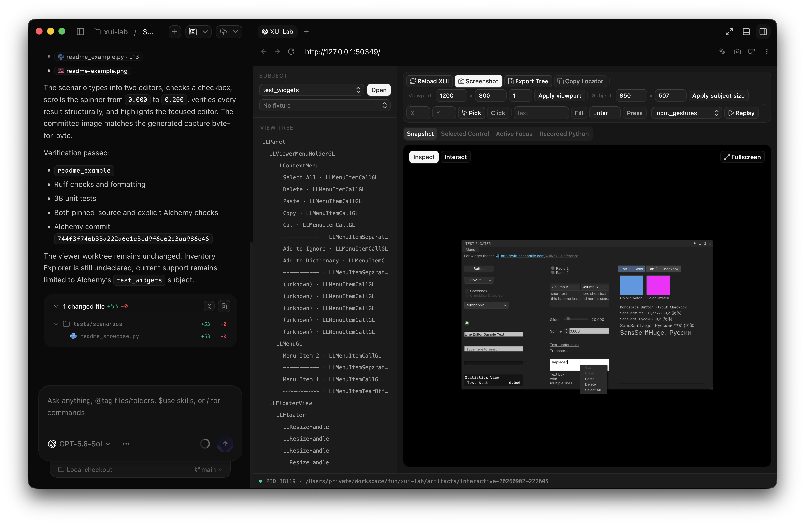

# `xui-lab`

> [!CAUTION]
> This project exists to improve my workflow for developing Second Life UIs. It
> isn't intended for anything beyond that, but it's public purely in case
> others find parts of it useful or inspiring.

This project uses real `LLFloater` code, with its production C++ controller,
XUI, and models, without logging in or loading a world. You look at it. You
click it. The clicks go through normal LLUI.



## Get a floater on screen

You need an Alchemy checkout and a matching `xui-lab` binary. The binary embeds
the viewer commit. `session start` and `interactive` reject a mismatch.

Build through the checkout's supported CMake graph. The
[`Alchemy adapter`](adapters/alchemy/README.md) injects the lab target. Keep
host-specific build commands in `AGENTS.local.md`. Then pass that binary as
`--runtime` and the checkout as `--viewer-source`.

To look at the test floater:

```sh
./xui-lab \
  --viewer-source alchemy=/path/to/alchemy \
  interactive test_widgets \
  --runtime /path/to/xui-lab \
  --width 1024 \
  --height 700 \
  --ui-scale 1.0 \
  --artifacts artifacts \
  --artifact-id floater-review
```

That opens a headed window and a local inspector. Interact mode sends clicks,
wheel, pointer drag, and keys through LLUI. Inspect mode outlines the control
under the pointer from the live production tree. **Reload** destroys and
recreates the subject after an XUI edit. A C++ edit needs a rebuild and a new
process.

Replace `test_widgets` with a subject from
[`adapters/alchemy/adapter.json`](adapters/alchemy/adapter.json).

## Drive it from the CLI

`interactive` is for looking. A persistent session is for commands. It starts a
hidden viewer, binds a user-local socket, and prints JSON. Pull the session id
out, then send one-shot commands at that process.

```sh
./xui-lab \
  --viewer-source alchemy=/path/to/alchemy \
  session start test_widgets \
  --runtime /path/to/xui-lab
```

```sh
SESSION=$(./xui-lab --viewer-source alchemy=/path/to/alchemy \
  session start test_widgets --runtime /path/to/xui-lab --jq .sessionId)

./xui-lab tree --session "$SESSION"
./xui-lab get --session "$SESSION" --label OK --jq .data.locator
./xui-lab click --session "$SESSION" --control-id CONTROL
./xui-lab fill --session "$SESSION" --control-id EDITOR --value "hello"
./xui-lab session close "$SESSION"
```

Save the session's input history as selector-stable JSON, then replay it in a
fresh session:

```sh
./xui-lab record --session "$SESSION" --output actions.json
./xui-lab replay actions.json --session "$OTHER_SESSION"
```

The recording stores selectors and action arguments, not session IDs or
request IDs. It is ordinary JSON intended for review and editing.

`tree` and `get` return a short excerpt by default. The full tree lands in an
artifact with path, size, and hash. `--include-tree` inlines the whole tree.
`--fields` keeps a few keys. `--jq` runs a jq expression on the JSON
document. Captures return PNG paths, never image bytes.

Selectors are `--control-id`, `--model-id`, `--path`, `--role`, `--label`,
`--placeholder`, and `--text`. Pick one. Conflicting flags fail at parse time.
The CLI converts the selected flag to the same versioned selector contract used
by the Python API, inspector, recorder, and scenario replay. Prefer a role and
accessible name, then a label, placeholder, visible text, or model ID. Use a
control ID only when no user-visible selector is unique. `--path` records XUI
provenance and is the last fallback.

After the CLI accepts a JSON command, a failure also writes an `ErrorRecord`.
`session close`, `reload`, and `run` accept `--dry-run`. Clicks and other input
gestures do not. Field lists and exit statuses live in
[`docs/CLI_CONTRACT.md`](docs/CLI_CONTRACT.md).
See [`docs/CLI_EXAMPLES.md`](docs/CLI_EXAMPLES.md) for complete discovery,
inspection, resize, capture, scenario, and cleanup commands.

## Replay a scenario

[`readme_example.py`](tests/scenarios/readme_example.py) fills the line editor
and the multiline editor, clicks the checkbox, and sends two upward wheel
steps to the spinner. The value goes from `0.000` to `0.200`. It reads each
control from the production tree and writes the capture only after the checks
pass.

```sh
./xui-lab \
  --viewer-source alchemy=/path/to/alchemy \
  run tests/scenarios/readme_example.py \
  --runtime /path/to/xui-lab \
  --artifacts artifacts/readme-example
```

```text
readme_example: passed [artifacts/readme-example/readme_example]
```

`Locator.scroll()` routes wheel input through `LLWindowCallbacks`.
`Locator.drag_to()` offers cargo through `LLView::handleDragAndDrop` and drops
only if the production handler accepts it. Use `Locator.drag_by()` or
`Window.drag()` for raw pointer drags such as floater resizing.

## Inspector frontend

The browser inspector is a React and TypeScript app in `inspector/`. Vite
builds it into `xui_lab/_inspector/`. FastAPI serves that build and the
`/api/v1` routes on a random loopback port. The browser receives an HttpOnly
session cookie. Unexpected `Host` and `Origin` headers are rejected. Captures
resolve through the current session artifact directory. Button, Input, Select,
Tabs, Toolbar, Toast, and Popover come from the Coss UI registry. They use
Base UI behavior and Coss neutral tokens. The resizable sidebar uses the
shadcn Base UI Resizable wrapper around react-resizable-panels. Tailwind CSS
supplies the generated utilities.

```sh
npm ci --prefix inspector
npm exec --prefix inspector -- playwright install chromium
npm run check --prefix inspector
```

`npm run check --prefix inspector` covers generated types, schema validation,
TypeScript, unit tests, the production build, and Playwright. Layout work can
skip the viewer:

```sh
python3 tests/integration/preview_inspector.py --capture /path/to/capture.png
npm run dev --prefix inspector
```

The production build records a source fingerprint. `./xui-lab check` fails
with the rebuild command when the embedded client is missing or stale. The
fingerprint covers the files the bundle is built from. Lint configuration,
unit tests, and Playwright tests do not make the embedded build stale.

## Check Python changes

Install the locked environment:

```sh
uv sync --locked
```

Run the checks through that environment:

```sh
uv run ruff check .
uv run ruff format --check .
uv run mypy
uv run coverage run -m pytest
uv run coverage report
uv run ./scripts/check-schemas
```

Pytest discovers tests under `tests/` but skips `tests/scenarios/`. Coverage
measures branches in `xui_lab` and enforces the current 59% floor.

## Build performance

Debug arm64 timings from an Apple M2 Ultra on 2 September 2026:

| Workload | Ninja actions | Wall time |
| --- | ---: | ---: |
| Initial `xui-lab` target | 1,285 | 181.99 s |
| Full `alchemy-bin` target | 788 | 287.52 s |
| Lab commit-metadata rebuild | 7 | 14.00 s |
| One adapter source compile and relink | 2 | 6.94 s |
| No-op lab build and source sync | 0 | 5.65 s |

Dependencies were already installed, and the viewer reused dependency targets
built for the lab. A persistent build tree reduces an adapter edit to one
compile and one link.

---

For design and build details, read [`SPEC.md`](SPEC.md),
[`forks.json`](forks.json), and the
[`Alchemy adapter contract`](adapters/alchemy/README.md).
